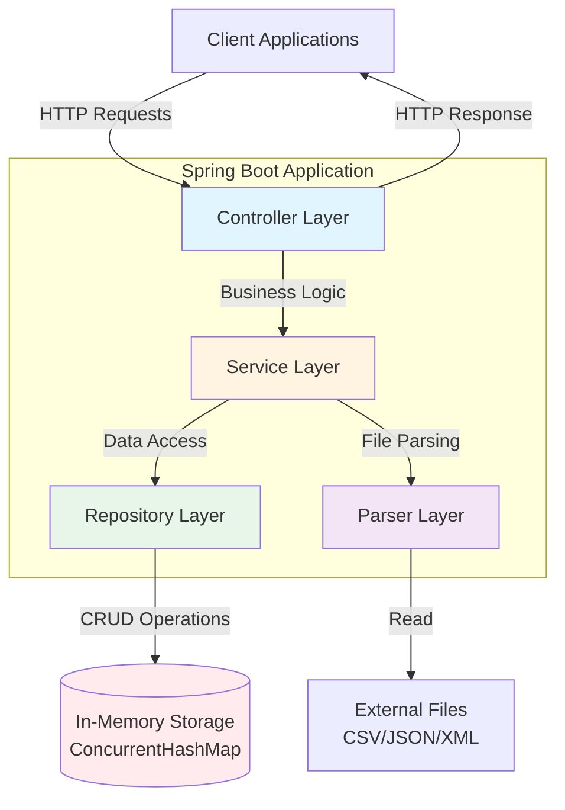
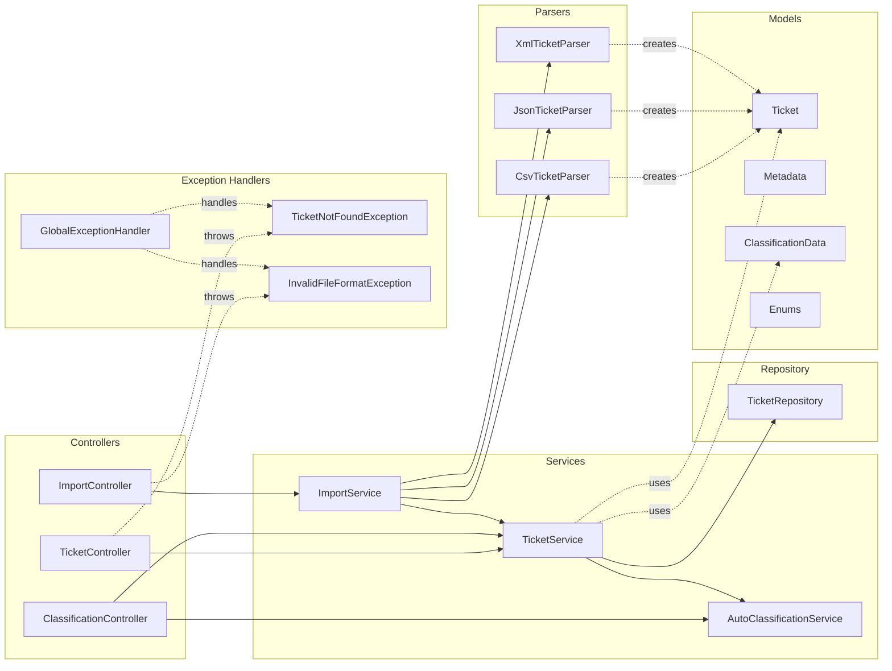
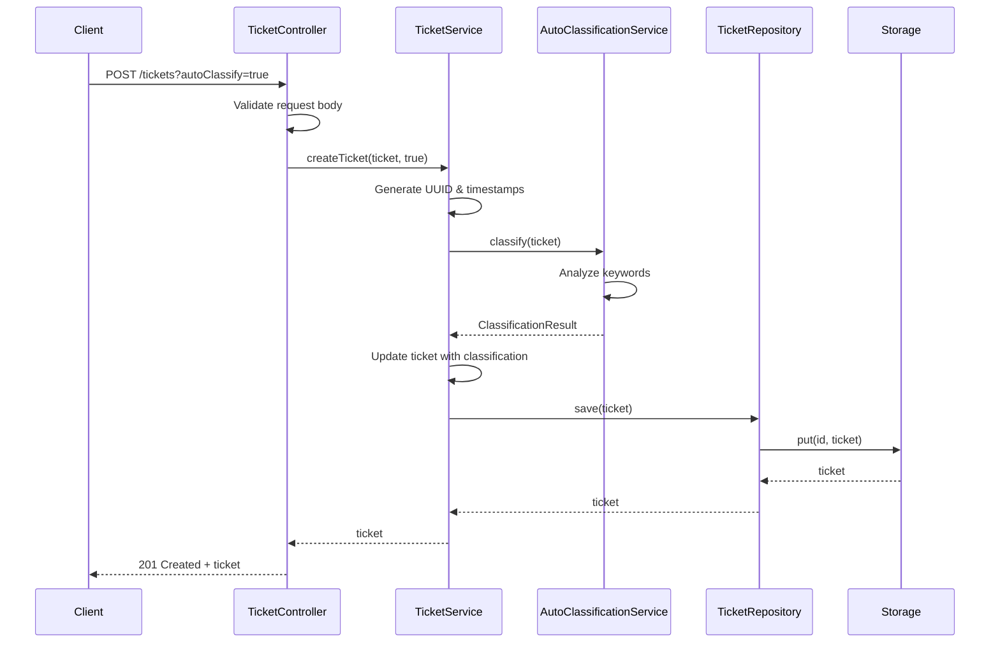
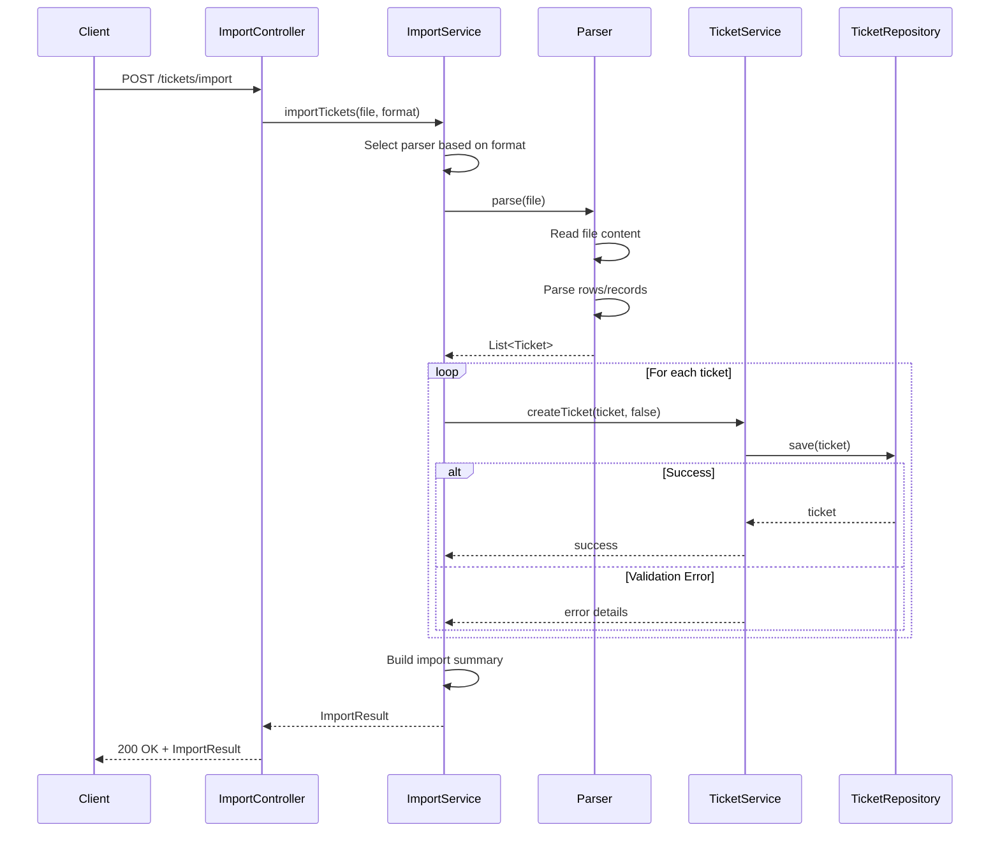
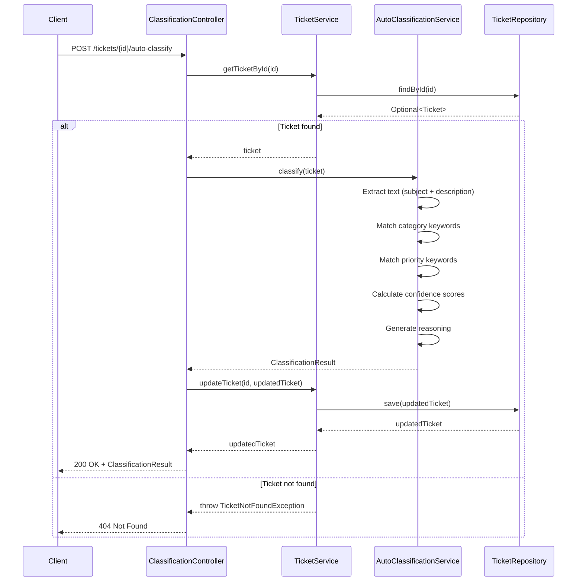
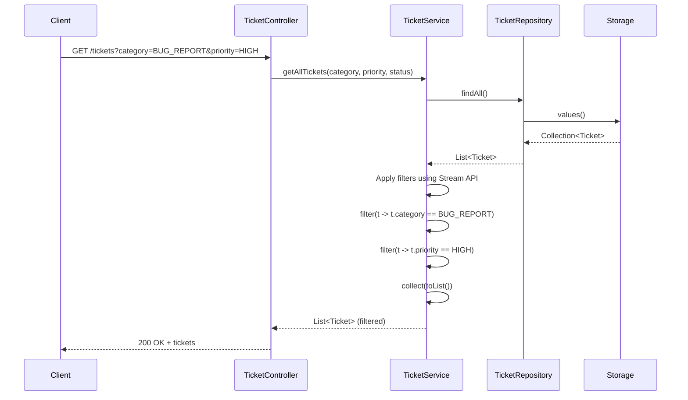
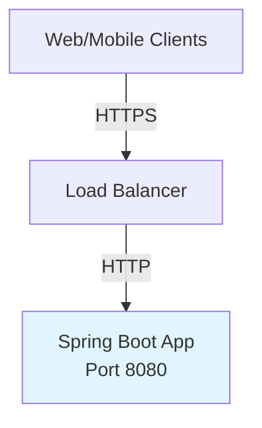
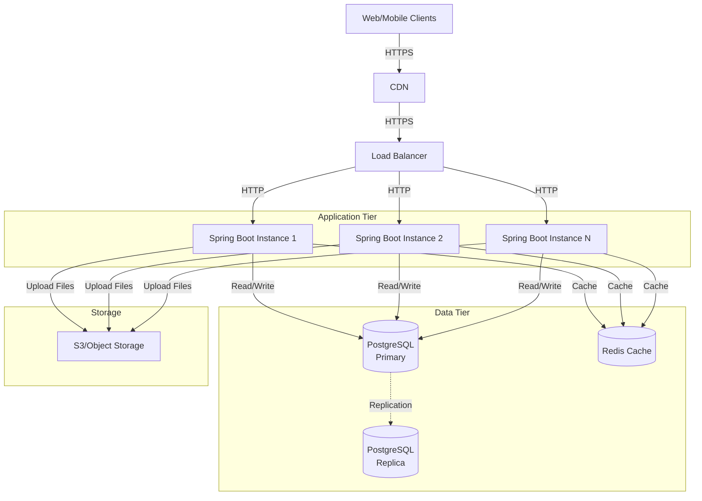

# Architecture Documentation

## Overview

The Customer Support Ticket Management System is a Spring Boot REST API designed with a layered architecture pattern, emphasizing separation of concerns, maintainability, and scalability.

---

## High-Level Architecture



---

## Component Architecture



---

## Layered Architecture

### 1. Controller Layer

**Responsibilities:**
- HTTP request/response handling
- Input validation orchestration
- HTTP status code management
- Route mapping

**Components:**
- `TicketController`: CRUD operations for tickets
- `ImportController`: Bulk import operations
- `ClassificationController`: Auto-classification endpoint

**Design Principles:**
- Thin controllers with minimal business logic
- Delegates to service layer for all business operations
- Uses Spring's `@RestController` for automatic JSON serialization
- Validates input using Bean Validation (`@Valid`)

---

### 2. Service Layer

**Responsibilities:**
- Business logic implementation
- Transaction coordination
- Data transformation
- Inter-service communication

**Components:**
- `TicketService`: Core ticket management logic
- `ImportService`: Orchestrates file parsing and ticket creation
- `AutoClassificationService`: Keyword-based classification algorithm

**Design Principles:**
- Single Responsibility Principle
- Service methods are atomic and reusable
- Uses `@Service` annotation for Spring component scanning
- Handles business exceptions

---

### 3. Repository Layer

**Responsibilities:**
- Data persistence abstraction
- CRUD operations
- Query filtering
- Thread-safe data access

**Components:**
- `TicketRepository`: In-memory data store using `ConcurrentHashMap`

**Design Principles:**
- Simple data access interface
- Thread-safe using concurrent collections
- Returns `Optional<T>` for safe null handling
- Filtering done in-memory using Java Streams

---

### 4. Parser Layer

**Responsibilities:**
- File format parsing
- Data extraction from CSV, JSON, XML
- Error handling for malformed files

**Components:**
- `TicketParser`: Common interface
- `CsvTicketParser`: CSV parsing using OpenCSV
- `JsonTicketParser`: JSON parsing using Jackson
- `XmlTicketParser`: XML parsing using Jackson XML

**Design Principles:**
- Strategy pattern for different file formats
- Consistent error handling across parsers
- Validation during parsing

---

### 5. Model Layer

**Responsibilities:**
- Domain object definitions
- Data validation rules
- Enum definitions

**Components:**
- `Ticket`: Main entity with 15 fields
- `Metadata`: Nested metadata object
- `ClassificationData`: Classification results
- Enums: `Category`, `Priority`, `Status`, `Source`, `DeviceType`

**Design Principles:**
- Rich domain models with validation
- Uses Bean Validation annotations
- Immutable where appropriate

---

### 6. Exception Handling

**Responsibilities:**
- Centralized error handling
- Consistent error responses
- HTTP status code mapping

**Components:**
- `GlobalExceptionHandler`: Catches and formats exceptions
- `TicketNotFoundException`: Custom 404 exception
- `InvalidFileFormatException`: Custom file parsing exception

**Design Principles:**
- `@ControllerAdvice` for global exception handling
- Structured error responses
- Appropriate HTTP status codes

---

## Data Flow Diagrams

### Create Ticket Flow



---

### Bulk Import Flow



---

### Auto-Classification Flow



---

### Query with Filters Flow



---

## Design Decisions

### 1. In-Memory Storage

**Decision:** Use `ConcurrentHashMap` for data storage instead of a database.

**Rationale:**
- Simplifies deployment (no database setup required)
- Fast read/write operations
- Sufficient for demonstration and testing purposes
- Thread-safe for concurrent operations

**Trade-offs:**
- Data is lost on application restart
- Limited by JVM heap size
- No complex query capabilities
- Not suitable for production at scale

**Future Consideration:**
- Can be replaced with JPA/Hibernate for persistence
- Repository pattern allows easy swapping

---

### 2. Strategy Pattern for Parsers

**Decision:** Use separate parser classes for each file format.

**Rationale:**
- Single Responsibility Principle
- Easy to add new file formats
- Clear separation of parsing logic
- Each parser can use optimal library

**Implementation:**
```java
interface TicketParser {
    List<Ticket> parse(MultipartFile file);
}

// CsvTicketParser, JsonTicketParser, XmlTicketParser implement TicketParser
```

**Benefits:**
- Maintainable and testable
- Format selection at runtime
- Consistent error handling

---

### 3. Keyword-Based Classification

**Decision:** Use simple keyword matching for auto-classification instead of ML.

**Rationale:**
- No training data required
- Fast and deterministic
- Easy to understand and debug
- Sufficient accuracy for common cases
- No external dependencies

**Implementation:**
- Predefined keyword lists per category/priority
- Case-insensitive matching
- Confidence scoring based on match count
- Generates human-readable reasoning

**Trade-offs:**
- Less accurate than ML models
- Cannot learn from new patterns
- Requires manual keyword maintenance

**Future Enhancement:**
- Could be replaced with NLP or ML model
- Service layer abstraction allows swapping

---

### 4. Bean Validation

**Decision:** Use JSR-303 Bean Validation annotations on model classes.

**Rationale:**
- Declarative validation rules
- Framework integration
- Consistent validation across layers
- Automatic error messages

**Example:**
```java
@Email(message = "Invalid email format")
private String customerEmail;

@Size(min = 10, max = 2000, message = "Description must be between 10 and 2000 characters")
private String description;
```

**Benefits:**
- Self-documenting models
- Centralized validation logic
- Integration with Spring MVC

---

### 5. RESTful API Design

**Decision:** Follow REST principles strictly.

**Rationale:**
- Industry standard
- Predictable URL structure
- Appropriate HTTP methods
- Proper status codes

**Implementation:**
- Resource-based URLs (`/tickets`, `/tickets/{id}`)
- HTTP methods: GET, POST, PUT, DELETE
- Status codes: 200, 201, 204, 400, 404, 500
- JSON request/response bodies

---

### 6. Exception Handling Strategy

**Decision:** Global exception handler using `@ControllerAdvice`.

**Rationale:**
- Centralized error handling
- Consistent error response format
- Separation from business logic
- Easy to extend

**Implementation:**
```java
@ControllerAdvice
public class GlobalExceptionHandler {
    @ExceptionHandler(TicketNotFoundException.class)
    public ResponseEntity<ErrorResponse> handleNotFound(...) {
        // Return 404 with error details
    }
}
```

**Benefits:**
- DRY principle
- Uniform error responses
- Easy debugging

---

## Security Considerations

### Current State

The current implementation does not include security features. This is acceptable for a demonstration project.

### Future Enhancements

For production deployment, consider:

1. **Authentication & Authorization**
   - Spring Security integration
   - JWT tokens for API authentication
   - Role-based access control (RBAC)
   - OAuth2 integration

2. **Input Validation**
   - Already implemented with Bean Validation
   - Additional sanitization for XSS prevention
   - SQL injection prevention (when using database)

3. **Rate Limiting**
   - Prevent abuse of bulk import
   - Throttle API requests per client

4. **HTTPS Only**
   - Force HTTPS in production
   - HSTS headers

5. **CORS Configuration**
   - Configure allowed origins
   - Restrict cross-origin requests

6. **Audit Logging**
   - Log all CRUD operations
   - Track who modified what

---

## Performance Considerations

### Current Optimizations

1. **Concurrent Collections**
   - `ConcurrentHashMap` for thread-safe operations
   - No locking required for reads

2. **Stream API for Filtering**
   - Efficient in-memory filtering
   - Lazy evaluation

3. **Validation at Entry Point**
   - Fail fast for invalid input
   - Reduces wasted processing

### Performance Characteristics

| Operation | Time Complexity | Notes |
|-----------|----------------|-------|
| Create Ticket | O(1) | HashMap put |
| Get by ID | O(1) | HashMap get |
| Update Ticket | O(1) | HashMap put |
| Delete Ticket | O(1) | HashMap remove |
| List All | O(n) | Iterate all tickets |
| Filter | O(n) | Stream filtering |
| Import | O(n*m) | n=records, m=avg validation time |
| Auto-Classify | O(k) | k=number of keywords |

### Scalability Considerations

**Current Limitations:**
- Limited by JVM heap size
- Single server deployment
- No horizontal scaling

**For Production Scale:**

1. **Database Backend**
   - PostgreSQL or MySQL
   - Indexed queries
   - Connection pooling

2. **Caching Layer**
   - Redis for frequently accessed tickets
   - Cache invalidation strategy

3. **Async Processing**
   - Queue-based bulk imports
   - Background classification jobs

4. **Load Balancing**
   - Multiple application instances
   - Stateless design enables horizontal scaling

5. **Database Optimization**
   - Proper indexing (category, priority, status)
   - Pagination for large result sets
   - Query optimization

---

## Testing Strategy

### Test Pyramid

The application follows the test pyramid approach:

1. **Unit Tests (70%)**
   - Service layer logic
   - Parser implementations
   - Auto-classification algorithm
   - Validation rules

2. **Integration Tests (20%)**
   - Controller + Service + Repository
   - End-to-end ticket lifecycle
   - Import workflows

3. **System Tests (10%)**
   - Full application context
   - Multi-threaded scenarios
   - Performance benchmarks

### Test Coverage

Target: >85% code coverage

Current coverage includes:
- All CRUD operations
- All three file format parsers
- Auto-classification logic
- Error handling scenarios
- Concurrent operations

---

## Technology Stack Justification

### Spring Boot 3.2.2

**Why:**
- Modern framework with auto-configuration
- Embedded server (no deployment complexity)
- Rich ecosystem
- Excellent testing support

**Alternatives Considered:**
- Micronaut: Less mature ecosystem
- Quarkus: Lower adoption
- Plain Spring: More configuration needed

---

### Java 21

**Why:**
- Latest LTS version
- Modern language features (records, pattern matching)
- Performance improvements
- Virtual threads for future scalability

**Alternatives Considered:**
- Java 17: Previous LTS, fewer features
- Kotlin: Team familiarity with Java

---

### OpenCSV

**Why:**
- Robust CSV parsing
- Handles edge cases (quotes, escaping)
- Well-maintained

**Alternatives Considered:**
- Apache Commons CSV: Similar capabilities
- Custom parser: Reinventing the wheel

---

### Jackson

**Why:**
- De facto standard for JSON in Java
- XML support via extension
- Spring Boot integration

**Alternatives Considered:**
- Gson: Less feature-rich
- JAXB: XML-only

---

### Maven

**Why:**
- Standard Java build tool
- Large plugin ecosystem
- Well-documented

**Alternatives Considered:**
- Gradle: More complex configuration

---

## Future Enhancements

### Short-term (1-3 months)

1. **Database Integration**
   - Add JPA/Hibernate
   - PostgreSQL backend
   - Migration scripts

2. **Pagination**
   - Page-based results for `/tickets`
   - Configurable page size

3. **Advanced Filtering**
   - Date range queries
   - Text search in subject/description
   - Tag-based filtering

4. **Email Notifications**
   - Notify on ticket creation
   - Status change notifications

### Medium-term (3-6 months)

1. **Authentication & Authorization**
   - User management
   - JWT tokens
   - Role-based permissions

2. **File Attachments**
   - Support file uploads
   - Store in S3 or local filesystem

3. **SLA Tracking**
   - Response time targets
   - Escalation rules
   - SLA breach alerts

4. **Machine Learning Classification**
   - Train model on historical data
   - Improved accuracy
   - Confidence scoring

### Long-term (6-12 months)

1. **Microservices Architecture**
   - Separate services for classification, import, etc.
   - Event-driven communication

2. **Analytics Dashboard**
   - Ticket metrics
   - Response time analysis
   - Category distribution

3. **Multi-tenancy**
   - Support multiple organizations
   - Data isolation

4. **Mobile App**
   - iOS/Android apps
   - Push notifications

---

## Deployment Architecture

### Current Deployment



### Recommended Production Deployment



---

## Monitoring & Observability

### Recommended Tools

1. **Metrics**: Prometheus + Grafana
2. **Logging**: ELK Stack (Elasticsearch, Logstash, Kibana)
3. **Tracing**: Jaeger or Zipkin
4. **Health Checks**: Spring Boot Actuator

### Key Metrics to Track

- Request rate (req/sec)
- Response time (p50, p95, p99)
- Error rate
- Active tickets count
- Import success/failure rate
- Classification confidence distribution

---

## Conclusion

The Customer Support Ticket Management System demonstrates a clean, layered architecture with clear separation of concerns. The design prioritizes simplicity and maintainability while providing a solid foundation for future enhancements.

Key architectural strengths:
- ✅ Layered architecture with clear responsibilities
- ✅ Strategy pattern for extensibility
- ✅ RESTful API design
- ✅ Comprehensive validation
- ✅ Centralized error handling
- ✅ Thread-safe operations

The architecture is production-ready with minor modifications (database integration, security, monitoring) and can scale horizontally when needed.
