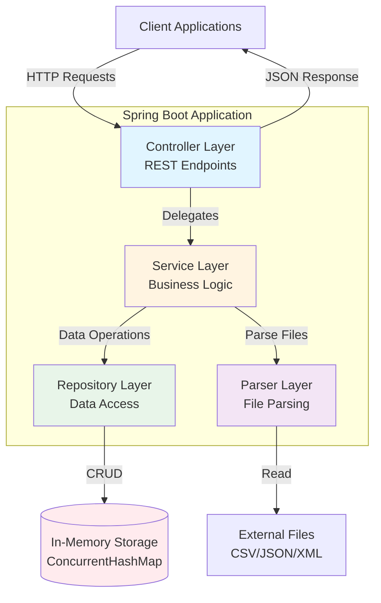

# Customer Support Ticket Management System

A Spring Boot REST API for managing customer support tickets with multi-format import capabilities (CSV, JSON, XML).

## Features

- **CRUD Operations**: Create, Read, Update, Delete support tickets
- **Auto-Classification**: Intelligent keyword-based categorization and priority detection
- **Multi-Format Import**: Bulk import tickets from CSV, JSON, or XML files
- **Filtering**: Query tickets by category, priority, and status
- **Validation**: Comprehensive input validation for all ticket fields
- **In-Memory Storage**: Fast, thread-safe in-memory data storage using ConcurrentHashMap

## Tech Stack

- **Java 21**
- **Spring Boot 3.2.2**
- **Maven**
- **OpenCSV** for CSV parsing
- **Jackson** for JSON/XML parsing

## Architecture

The system follows a layered architecture with clear separation of concerns:



**Key Components:**
- **Controllers**: Handle HTTP requests, validate input, return responses
- **Services**: Implement business logic, coordinate operations
- **Repository**: Manage in-memory data storage (thread-safe)
- **Parsers**: Parse CSV, JSON, XML files into ticket objects

For detailed architecture documentation, see [ARCHITECTURE.md](ARCHITECTURE.md).

## Project Structure

```
src/
├── main/
│   ├── java/com/support/ticketsystem/
│   │   ├── TicketSystemApplication.java
│   │   ├── controller/
│   │   │   ├── TicketController.java
│   │   │   ├── ImportController.java
│   │   │   └── ClassificationController.java
│   │   ├── service/
│   │   │   ├── TicketService.java
│   │   │   ├── ImportService.java
│   │   │   └── AutoClassificationService.java
│   │   ├── repository/
│   │   │   └── TicketRepository.java
│   │   ├── model/
│   │   │   ├── Ticket.java
│   │   │   ├── Metadata.java
│   │   │   ├── ClassificationData.java
│   │   │   ├── Category.java
│   │   │   ├── Priority.java
│   │   │   ├── Status.java
│   │   │   ├── Source.java
│   │   │   └── DeviceType.java
│   │   ├── parser/
│   │   │   ├── TicketParser.java
│   │   │   ├── CsvTicketParser.java
│   │   │   ├── JsonTicketParser.java
│   │   │   └── XmlTicketParser.java
│   │   ├── dto/
│   │   │   ├── ImportResult.java
│   │   │   └── ClassificationResult.java
│   │   └── exception/
│   │       ├── GlobalExceptionHandler.java
│   │       ├── TicketNotFoundException.java
│   │       └── InvalidFileFormatException.java
│   └── resources/
│       └── application.properties
└── test/
    └── java/com/support/ticketsystem/
        └── controller/
            └── TicketControllerTest.java

data/
├── sample_tickets.csv (50 tickets)
├── sample_tickets.json (20 tickets)
├── sample_tickets.xml (30 tickets)
├── invalid_tickets.csv
├── invalid_tickets.json
├── invalid_tickets.xml
└── malformed.csv
```

## Getting Started

### Prerequisites

- Java 21 or higher
- Maven 3.6+

### Installation

1. Clone the repository
2. Navigate to the project directory
3. Build the project:
   ```bash
   mvn clean install
   ```

### Running the Application

```bash
mvn spring-boot:run
```

The application will start on `http://localhost:8080`

### Running Tests

```bash
mvn test
```

## API Endpoints

### Ticket CRUD Operations

| Method | Endpoint | Description |
|--------|----------|-------------|
| `POST` | `/tickets` | Create a new support ticket |
| `POST` | `/tickets?autoClassify=true` | Create ticket with auto-classification |
| `GET` | `/tickets` | List all tickets (with optional filtering) |
| `GET` | `/tickets/{id}` | Get specific ticket by ID |
| `PUT` | `/tickets/{id}` | Update an existing ticket |
| `DELETE` | `/tickets/{id}` | Delete a ticket |

### Auto-Classification

| Method | Endpoint | Description |
|--------|----------|-------------|
| `POST` | `/tickets/{id}/auto-classify` | Auto-classify an existing ticket |

### Bulk Import

| Method | Endpoint | Description |
|--------|----------|-------------|
| `POST` | `/tickets/import` | Bulk import tickets from file |

## API Examples

### Create a Ticket

```bash
curl -X POST http://localhost:8080/tickets \
  -H "Content-Type: application/json" \
  -d '{
    "customer_id": "CUST001",
    "customer_email": "john.doe@example.com",
    "customer_name": "John Doe",
    "subject": "Cannot login to account",
    "description": "I have been trying to login for the past hour but keep getting invalid credentials error",
    "category": "OTHER",
    "priority": "HIGH",
    "status": "NEW",
    "tags": ["login", "urgent"],
    "metadata": {
      "source": "WEB_FORM",
      "browser": "Chrome",
      "device_type": "DESKTOP"
    }
  }'
```

### Get All Tickets

```bash
curl http://localhost:8080/tickets
```

### Filter Tickets

```bash
curl "http://localhost:8080/tickets?category=BUG_REPORT&priority=HIGH&status=NEW"
```

### Get Ticket by ID

```bash
curl http://localhost:8080/tickets/{ticket-id}
```

### Update Ticket

```bash
curl -X PUT http://localhost:8080/tickets/{ticket-id} \
  -H "Content-Type: application/json" \
  -d '{
    "customer_id": "CUST001",
    "customer_email": "john.doe@example.com",
    "customer_name": "John Doe",
    "subject": "Cannot login to account",
    "description": "Issue resolved after password reset",
    "category": "ACCOUNT_ACCESS",
    "priority": "HIGH",
    "status": "RESOLVED",
    "tags": ["login", "resolved"],
    "metadata": {
      "source": "WEB_FORM",
      "browser": "Chrome",
      "device_type": "DESKTOP"
    }
  }'
```

### Delete Ticket

```bash
curl -X DELETE http://localhost:8080/tickets/{ticket-id}
```

### Bulk Import Tickets

**CSV Import:**
```bash
curl -X POST http://localhost:8080/tickets/import \
  -F "file=@data/sample_tickets.csv" \
  -F "format=csv"
```

**JSON Import:**
```bash
curl -X POST http://localhost:8080/tickets/import \
  -F "file=@data/sample_tickets.json" \
  -F "format=json"
```

**XML Import:**
```bash
curl -X POST http://localhost:8080/tickets/import \
  -F "file=@data/sample_tickets.xml" \
  -F "format=xml"
```

### Auto-Classify Existing Ticket

```bash
curl -X POST http://localhost:8080/tickets/0955d259-3575-4dbd-8e20-8bbc89b3c276/auto-classify
```

**Response:**
```json
{
  "category": "ACCOUNT_ACCESS",
  "priority": "URGENT",
  "confidence": 0.33,
  "reasoning": "Detected keywords for category ACCOUNT_ACCESS: [authentication, critical, access]. Detected keywords for priority URGENT: [critical]",
  "keywordsFound": ["authentication", "critical", "access"]
}
```

### Create Ticket with Auto-Classification

```bash
curl -X POST "http://localhost:8080/tickets?autoClassify=true" \
  -H "Content-Type: application/json" \
  -d '{
    "customer_id": "CUST001",
    "customer_email": "john.doe@example.com",
    "customer_name": "John Doe",
    "subject": "Critical authentication failure",
    "description": "Users cannot login due to authentication service outage",
    "tags": ["urgent", "security"],
    "metadata": {
      "source": "EMAIL",
      "browser": "N/A",
      "device_type": "DESKTOP"
    }
  }'
```

The ticket will be automatically classified and the response will include `classification_data` with the detected category, priority, confidence score, and reasoning.

## Data Model

### Ticket Fields

| Field | Type | Required | Validation |
|-------|------|----------|------------|
| `id` | UUID | Auto-generated | - |
| `customer_id` | String | Yes | Not blank |
| `customer_email` | String | Yes | Valid email format |
| `customer_name` | String | Yes | Not blank |
| `subject` | String | Yes | 1-200 characters |
| `description` | String | Yes | 10-2000 characters |
| `category` | Enum | Yes | See categories below |
| `priority` | Enum | Yes | URGENT, HIGH, MEDIUM, LOW |
| `status` | Enum | Yes | NEW, IN_PROGRESS, WAITING_CUSTOMER, RESOLVED, CLOSED |
| `created_at` | DateTime | Auto-generated | ISO-8601 format |
| `updated_at` | DateTime | Auto-generated | ISO-8601 format |
| `resolved_at` | DateTime | Optional | ISO-8601 format |
| `assigned_to` | String | Optional | - |
| `tags` | Array | Required | Can be empty |
| `metadata` | Object | Yes | See metadata below |
| `classification_data` | Object | Optional | Auto-generated when using auto-classify |

### Categories

- `ACCOUNT_ACCESS` - Login, password, authentication issues
- `TECHNICAL_ISSUE` - Bugs, errors, technical problems
- `BILLING_QUESTION` - Payments, invoices, subscriptions
- `FEATURE_REQUEST` - Enhancement suggestions
- `BUG_REPORT` - Defects with reproduction steps
- `OTHER` - Uncategorizable issues

### Metadata Object

| Field | Type | Required | Values |
|-------|------|----------|--------|
| `source` | Enum | Yes | WEB_FORM, EMAIL, API, CHAT, PHONE |
| `browser` | String | Optional | Browser name/version |
| `device_type` | Enum | Yes | DESKTOP, MOBILE, TABLET |

### Classification Data Object

| Field | Type | Description |
|-------|------|-------------|
| `category` | Enum | Auto-detected category |
| `priority` | Enum | Auto-detected priority |
| `confidence` | Double | Confidence score (0-1) |
| `reasoning` | String | Explanation of classification |
| `auto_classified` | Boolean | Whether classification was automatic |

## Auto-Classification System

The system includes an intelligent auto-classification feature that analyzes ticket subject and description to automatically assign category and priority.

### How It Works

1. **Keyword Matching**: Analyzes text for predefined keywords associated with categories and priorities
2. **Confidence Scoring**: Calculates confidence based on number of matched keywords
3. **Reasoning**: Provides explanation of why a particular classification was chosen

### Category Keywords

- **ACCOUNT_ACCESS**: login, password, authentication, access, credentials, locked, reset, signin, 2fa, mfa, sso, oauth
- **TECHNICAL_ISSUE**: error, crash, bug, broken, not working, issue, problem, failure, exception, timeout
- **BILLING_QUESTION**: payment, invoice, charge, billing, refund, subscription, upgrade, downgrade, pricing, cost
- **FEATURE_REQUEST**: feature, enhancement, suggest, improve, request, add, wishlist, idea, proposal
- **BUG_REPORT**: bug, reproduce, steps to reproduce, expected, actual, defect

### Priority Keywords

- **URGENT**: critical, urgent, emergency, asap, immediate, security, production down, outage
- **HIGH**: important, blocking, cannot work, major, serious, asap
- **LOW**: minor, cosmetic, suggestion, nice to have, enhancement, future

## Import Response Format

```json
{
  "total": 50,
  "successful": 47,
  "failed": 3,
  "errors": [
    {
      "row": 5,
      "reason": "Invalid email format"
    },
    {
      "row": 12,
      "reason": "Description too short"
    },
    {
      "row": 23,
      "reason": "Invalid category value"
    }
  ]
}
```

## CSV Format

The CSV file should use semicolons (`;`) to separate array values in the `tags` field.

**Example:**
```csv
id,customer_id,customer_email,customer_name,subject,description,category,priority,status,created_at,updated_at,resolved_at,assigned_to,tags,source,browser,device_type
550e8400-e29b-41d4-a716-446655440001,CUST001,john@example.com,John Doe,Login Issue,Cannot access account,ACCOUNT_ACCESS,HIGH,NEW,2026-02-01T09:00:00,2026-02-01T09:00:00,,,login;password;urgent,WEB_FORM,Chrome,DESKTOP
```

## Error Handling

The API returns appropriate HTTP status codes:

- `200 OK` - Successful GET/PUT requests
- `201 Created` - Successful POST requests
- `204 No Content` - Successful DELETE requests
- `400 Bad Request` - Validation errors
- `404 Not Found` - Resource not found
- `500 Internal Server Error` - Server errors

Error responses include:
```json
{
  "timestamp": "2026-02-08T10:30:00",
  "status": 400,
  "error": "Bad Request",
  "message": "Validation failed",
  "errors": {
    "customerEmail": "Invalid email format",
    "description": "Description must be between 10 and 2000 characters"
  }
}
```

## Sample Data

The `data/` directory contains sample files for testing:

- **sample_tickets.csv** - 50 valid tickets
- **sample_tickets.json** - 20 valid tickets  
- **sample_tickets.xml** - 30 valid tickets
- **invalid_tickets.*** - Files with validation errors for negative testing
- **malformed.csv** - Malformed file for error handling testing

---

## Documentation

For detailed information, refer to these documentation files:

- **[API_REFERENCE.md](API_REFERENCE.md)** - Complete API documentation with examples and cURL commands
- **[ARCHITECTURE.md](ARCHITECTURE.md)** - System architecture, design decisions, and component interactions
- **[TESTING_GUIDE.md](TESTING_GUIDE.md)** - Testing strategy, test coverage, and how to run tests

---

## License

This project is created for educational purposes.
