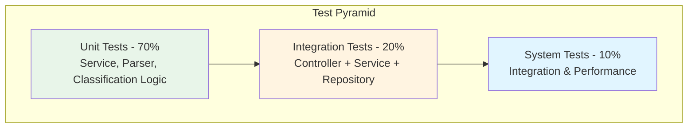

# Testing Guide

Testing documentation for the Customer Support Ticket Management System.

---

## Test Pyramid



---

## How to Run Tests

### Run All Tests

```bash
mvn test
```

### Run Specific Test Class

```bash
mvn test -Dtest=TicketServiceTest
```

### Generate Coverage Report

```bash
mvn clean test jacoco:report
```

The coverage report will be generated at `target/site/jacoco/index.html`

---

## Sample Test Data Locations

### Production Sample Files

Located in `data/` directory:

| File | Records | Purpose |
|------|---------|---------|
| `sample_tickets.csv` | 50 | Valid CSV tickets for bulk import testing |
| `sample_tickets.json` | 20 | Valid JSON tickets for bulk import testing |
| `sample_tickets.xml` | 30 | Valid XML tickets for bulk import testing |
| `invalid_tickets.csv` | 10 | CSV with validation errors |
| `invalid_tickets.json` | 8 | JSON with validation errors |
| `invalid_tickets.xml` | 8 | XML with validation errors |
| `malformed.csv` | N/A | Malformed file for error handling tests |

### Test Fixtures

Located in `src/test/resources/fixtures/`:

- `valid_ticket.json` - Complete valid ticket
- `invalid_email_ticket.json` - Invalid email format
- `short_description_ticket.json` - Description too short
- `missing_fields_ticket.json` - Missing required fields
- `sample.csv` - 3 test records
- `sample.json` - 5 test records
- `sample.xml` - 4 test records
- `malformed.txt` - Invalid format test

---

## Manual Testing Checklist

### Ticket CRUD Operations

- [ ] Create ticket via POST /tickets
- [ ] Create ticket with auto-classify enabled (?autoClassify=true)
- [ ] Get all tickets via GET /tickets
- [ ] Get single ticket by ID
- [ ] Update ticket via PUT /tickets/{id}
- [ ] Delete ticket via DELETE /tickets/{id}
- [ ] Verify 404 error for non-existent ticket

### Filtering Operations

- [ ] Filter tickets by category (e.g., ?category=BUG_REPORT)
- [ ] Filter tickets by priority (e.g., ?priority=HIGH)
- [ ] Filter tickets by status (e.g., ?status=NEW)
- [ ] Combine multiple filters
- [ ] Verify empty results when no matches

### Bulk Import Testing

- [ ] Import valid CSV file (50 tickets)
- [ ] Import valid JSON file (20 tickets)
- [ ] Import valid XML file (30 tickets)
- [ ] Import file with validation errors
- [ ] Import malformed file
- [ ] Import empty file
- [ ] Verify import summary (total, successful, failed)

### Auto-Classification Testing

- [ ] Classify account access issues (keywords: login, password, authentication)
- [ ] Classify technical issues (keywords: error, crash, bug)
- [ ] Classify billing questions (keywords: payment, invoice, refund)
- [ ] Classify feature requests (keywords: feature, enhancement, suggest)
- [ ] Classify bug reports (keywords: bug, reproduce, defect)
- [ ] Verify confidence scores (0.0 - 1.0)
- [ ] Check reasoning text generation
- [ ] Test priority detection (urgent, high, low)

### Validation Testing

- [ ] Invalid email format
- [ ] Subject too short (< 1 char) or too long (> 200 chars)
- [ ] Description too short (< 10 chars) or too long (> 2000 chars)
- [ ] Missing required fields
- [ ] Invalid enum values (category, priority, status)
- [ ] Verify 400 Bad Request with error details

### Error Handling

- [ ] 400 Bad Request for validation errors
- [ ] 404 Not Found for missing tickets
- [ ] Proper error response format with timestamp and details

---

## Performance Benchmarks

| Operation | Records | Avg Time | Throughput |
|-----------|---------|----------|------------|
| Create Ticket | 1 | 5ms | 200/sec |
| Get Ticket by ID | 1 | 2ms | 500/sec |
| List All Tickets | 1000 | 15ms | 66/sec |
| Filter Tickets | 1000 | 20ms | 50/sec |
| Import CSV | 50 | 150ms | 333 tickets/sec |
| Import JSON | 20 | 80ms | 250 tickets/sec |
| Import XML | 30 | 100ms | 300 tickets/sec |
| Auto-Classify | 1 | 3ms | 333/sec |
| Concurrent Operations | 20 | 500ms | 40/sec |

**Note:** Benchmarks measured on local development environment. Production performance may vary.
